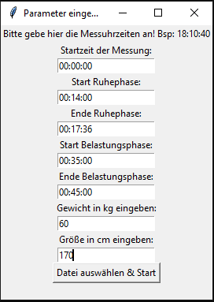
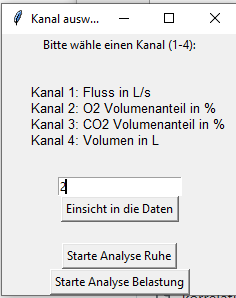
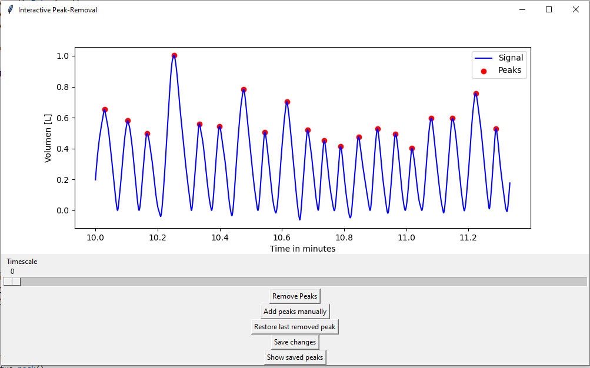
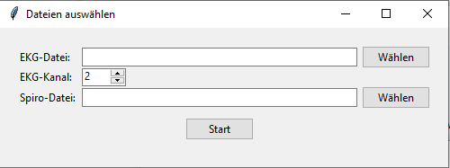
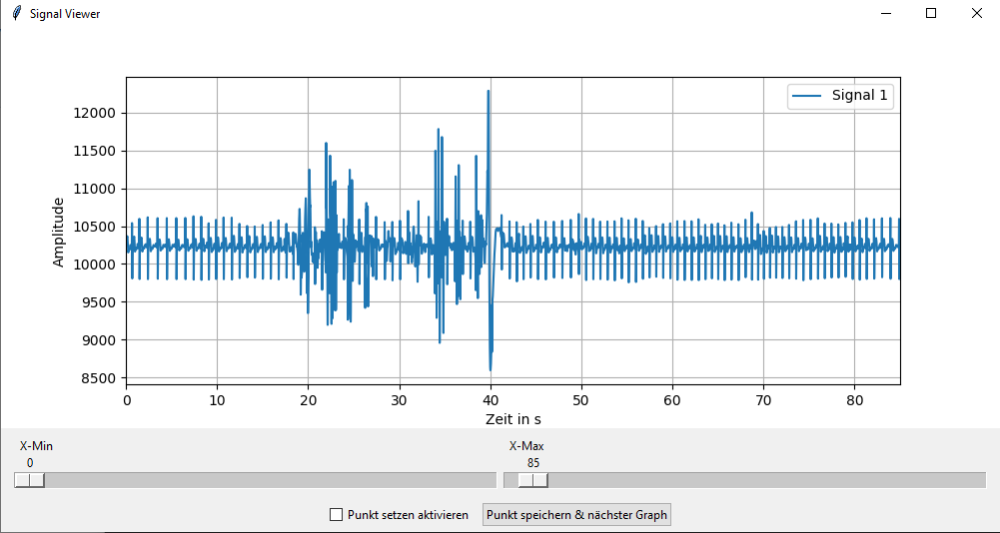
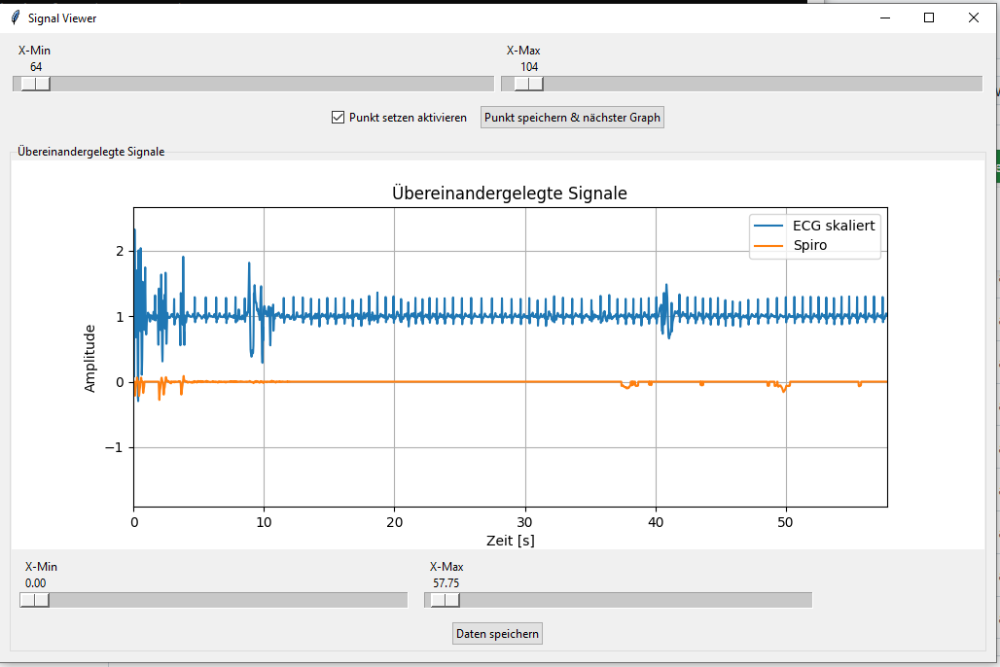
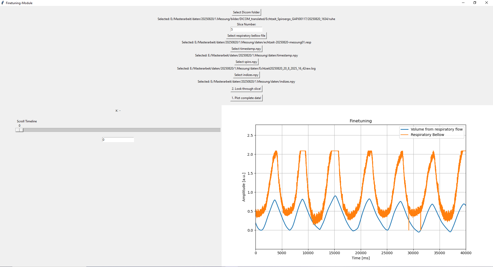
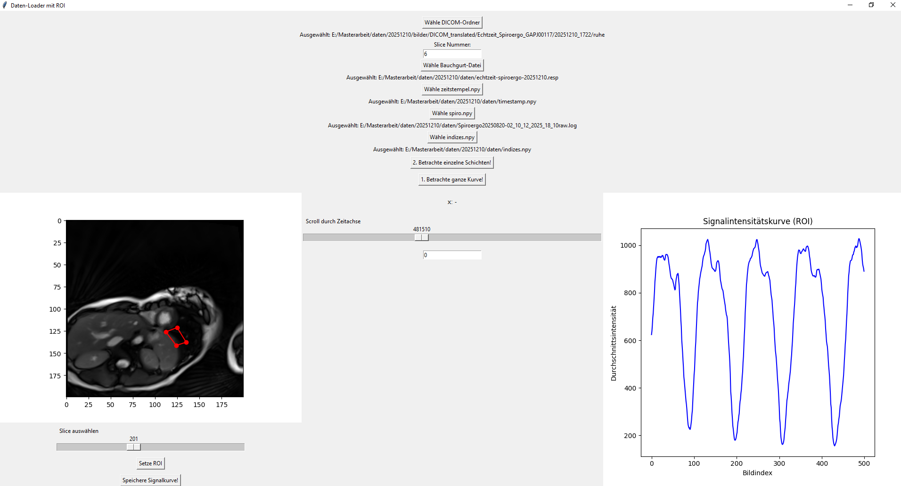
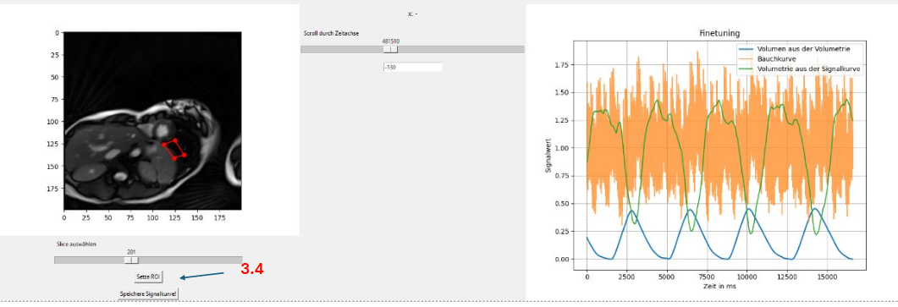
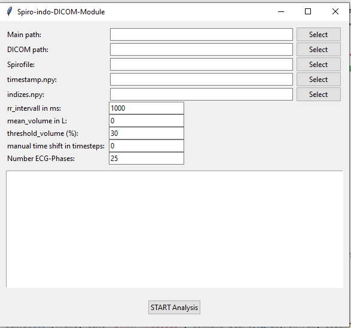

# Analysis and Correlation of Spirometry and Real-Time Cardiac MRI Data

## Short Description
This project is designed for the analysis, temporal correlation, and further processing of spirometry, ECG, and imaging data acquired during real-time cardiac MRI in combination with an ergometer system.

The goal is to correlate respiratory parameters with MRI image data, integrate them into DICOM files, and enable image-based analysis during end-expiration.

## Application Area
The software was developed for research purposes, particularly for the analysis of cardiac parameters under resting and exercise conditions without the use of breath-hold commands.

---

## Workflow Overview

1. **Analysis of spirometry data**
2. **Correlation of spiro and ecg data**
3. **Fine-tuning of the correlation using the respiratory belt signal and signal intensivity curve**
4. **Insertion of respiratory parameters into the DICOM image data**
- readout files
- add spiro data into dicom tags
- binning into 25 ecg-phases
- binning into exspiration and inspiration of images
- filter sequence of 25 mri images of each ecg phase in endexspiration for each slice

The analysis consists of **three main scripts**.

---

## Module Overview

### 1. Spirometry Module
In the spirometry module, advanced respiratory parameters are calculated from spirometry data for both resting and exercise phases.  
This is achieved by detecting **peaks and valleys** in the respiratory flow signal.

#### Input Data
- Spirometry file containing:
  - Respiratory flow  
  - O₂ volume fraction  
  - CO₂ volume fraction  
  - Log time  

#### Output Data
- Excel file containing evaluated spirometry parameters:
  - Average tidal volume  
  - Minute ventilation  
  - Maximum and minimum O₂ volume fractions  
  - Maximum and minimum CO₂ volume fractions  
  - Respiratory rate  

---

### 2. Correlation of Spirometry and ECG Data
The ECG data have the same sampling rate and log times as the MRI image data.  
By correlating spirometry and ECG signals, an indirect correlation with the image data is established.

The correlation is performed using **manually defined time markers** that were set at the beginning of the measurement.

#### Input Data
- Spirometry file  
- ECG file  

#### Output Data
- Timestamp of the marker  
- Indices of the marker in:
  - Spirometry data  
  - ECG data  

These indices allow the datasets to be trimmed so that all signals share a common start time.

---

### 2.2 Verification and Fine-Tuning Using the Respiratory Belt Signal
To verify the temporal correlation, the respiratory belt signal and a signal intensity curve from one image slice are additionally used.

If necessary, the marker indices can be manually adjusted to improve synchronization.

#### Input Data
- Spirometry file  
- Respiratory belt signal  
- Image data  

#### Output Data
- Adjusted time marker indices after fine-tuning  

---

### 3. Writing Respiratory Parameters into the DICOM Files
After successful correlation, **respiratory flow and tidal volume** are assigned to each image of the real-time MRI sequence and written into the DICOM files.

The images are then filtered as follows:

- Filtering for **expiration** (negative respiratory flow)
- Filtering for **end-expiration**
- Classification of images into:
  - Two tidal volume groups  
    - below a defined threshold  
    - above the threshold  
  - 25 ECG classes (time after the R-wave)

The threshold is defined as a fraction of the average tidal volume (e.g., 30%).

From all images acquired during end-expiration, one representative image per slice and per ECG class is selected.

#### Input Data
- Spirometry file  
- MRI image data  

#### Output Data
- Image sequences representing one full cardiac cycle per slice during end-expiration  

These image sequences can subsequently be analyzed in **Circle** and compared with conventional cardiac MRI sequences.

---

## How to Use

### Step 1: Run the Spirometry Module

  
  
  

#### 1.1 Enter Required Metadata
- Enter the **start time of the measurement**  
  Format: `hh:mm:ss` (e.g. `00:00:00`)
- Enter all required time values in the same format  
  Example: `00:15:12`
- Enter **body weight** (kg) and **height** (cm)  
  Example: `60` and `180`
- Click **“Datei auswählen & Start”** and select the spirometry file

If the exact times are not known yet:
- Enter temporary (dummy) times and run the program
- Enter values **1–4** to select an ECG channel to inspect the spirometry signal
- Identify the correct timestamps within the displayed data
- Restart the program and enter the correct times

---

#### 1.2 Run Analysis – Rest Phase
Click **“Starte Analyse Ruhe”** to begin the resting phase analysis.

For each signal:
- A new window opens showing the signal with automatically detected peaks
- Click **“Entferne Peaks”** and remove incorrect peaks by clicking on the red markers
- Click **“Peaks manuell hinzufügen”** to add missing peaks by clicking into the plot
- Click **“Speichern der Änderungen”** to save the corrections and close the window

This procedure is repeated **four times** for:
1. Respiratory volume  
2. O₂ volume fraction (%)  
3. CO₂ volume fraction (%)  
4. Respiratory flow  

After the fourth window is closed, an **Excel file** is generated containing all parameters required for further processing.

---

#### 1.3 Run Analysis – Exercise Phase
Repeat the steps from **1.2** by clicking **“Starte Analyse Belastung”**.

---

### Step 2: Run Korrelation_EXE

#### 2.1 Load Data
- Select the **ECG file** and **spirometry file**
- Choose the ECG channel that provides the best visible timestamp markers
- Click **Start**

---

#### 2.2 Correlate Timestamps
- A new window displaying the ECG signal will open
- Adjust the view using the sliders if necessary
- Activate **“Punkt setzen aktivieren”**
- Click on the timestamp start in the ECG plot
- Click **“Punkt speichern & nächster Graph”**
- The spirometry signal will be displayed
- Click on the corresponding timestamp start in the spirometry plot
- Click **“Punkt speichern & nächster Graph”**

Spirometry and ECG signals are now plotted together:
- If the correlation is correct, click **“Daten speichern”**
- If not, restart the program and repeat the procedure

---

### Step 3: Run Finetuning_Korrelation_EXE

#### 3.1 Select Input Data
- Select the **DICOM folder** containing the real-time images  
  Expected folder structure: path/Dicom_translated/Echtzeit_Spiroergo_XXXX/date_of_measurement/realtime_images/

- Select:
- Slice number for ROI definition
- `timestamp.npy`
- `indices.npy`
- Spirometry file

---

#### 3.2 Inspect Global Correlation
- Click **“1. Betrachte ganze Kurve”**
- Spirometry and respiratory belt signals are plotted together
- Visually assess whether a temporal shift is required

---

#### 3.3 Adjust Temporal Shift
- Hover over the plot to read the x-coordinate (in milliseconds)
- Determine the required shift between signals
- Divide the time difference by **8** to convert to timestamp units
- Enter the calculated value below the slider
- Click **“1. Betrachte ganze Kurve”** again to verify

---

#### 3.4 ROI-Based Verification
- Click **“2. Betrachte einzelne Schichten”**
- A window showing all images of the selected slice opens
- Click **“Setze ROI”** and select the ROI in the correct order
- Click **“Speichere Signalkurve!”**

The following curves are plotted:
- Signal intensity curve (ROI)
- Respiratory belt signal
- Spirometry signal

If necessary, repeat the shift adjustment using the new plot.

**Shift direction:**
- Move spirometry signal to the right → **negative values**
- Move spirometry signal to the left → **positive values**

⚠️ **Remember the final shift value for Step 4.**

---

### Step 4: Run Spiro_into_Dicom_EXE

#### 4.1 Select Required Files and Parameters
- **Main-Pfad**: output directory for processed images
- **Dicom-Pfad**: folder containing real-time DICOM images
- **Spirodatei**: spirometry file
- `timestamp.npy`
- `indices.npy`
- **RR interval (ms)**: e.g. `1000`
- **Mean tidal volume (L)**: value from Excel file generated in Step 1
- **Threshold volume**:  Defines end-expiration condition  
- **Manuelle Verschiebung (Zeitschritte)**: fine-tuning shift from Step 3
- **Anzahl EKG-Phasen**: number of ECG phases per slice

---

#### 4.2 Run Processing
- Click **Start** to execute the program
- The output consists of filtered DICOM image sequences categorized by ECG phase and end-expiration

## Motivation
During exercise, breath-hold commands are not practical.  
The implemented filtering approach enables the generation of image data comparable to conventional cardiac MRI acquisitions, which are typically performed during breath-hold at end-expiration.

---

## Notes
- The software is intended for research use only.
- Manual time markers are essential for accurate correlation.
- The quality of the respiratory belt signal directly affects the fine-tuning process.

---

## Author / Context
Developed as part of a scientific project on real-time cardiac MRI under physical exercise conditions.
